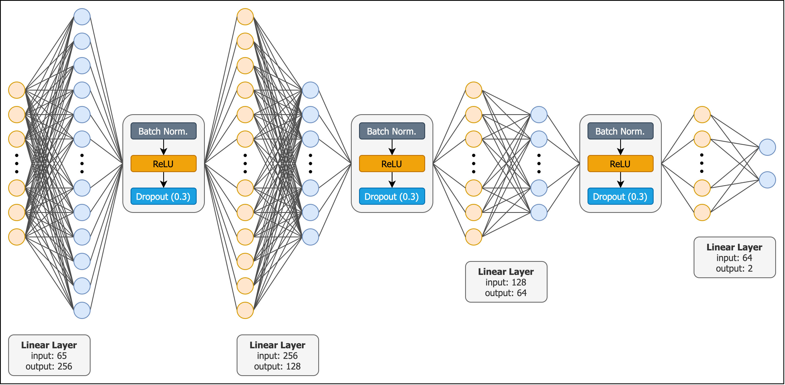
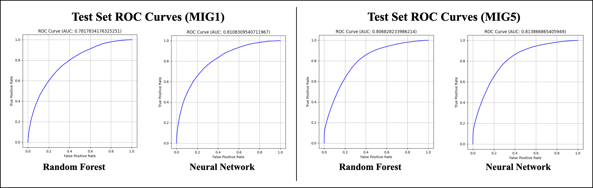
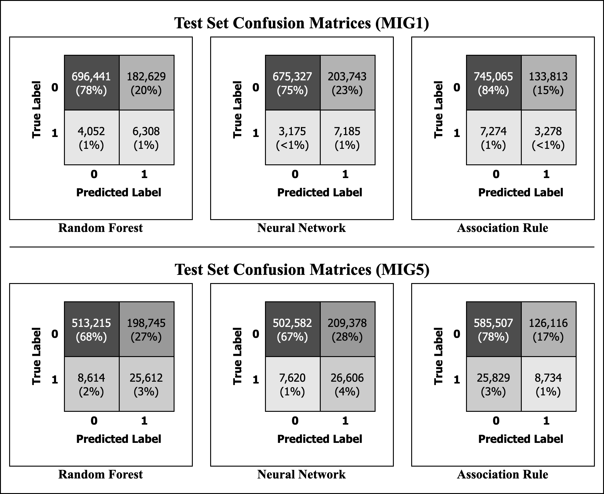

# Migration in Mozambique
_CSCI 5523 Final Project (University of Minnesota, Fall 2025)_

Gabe Buchmann, Drew Gjerstad, Arlan Hegenbarth, Aaron Meyerhofer, and Hasan Raza

> [!IMPORTANT]
> The data used in this project is sourced from _IPUMS International_. Access to
> their data repositories is restricted according to their usage license. To
> gain access, apply for an account using [this form](https://uma.pop.umn.edu/ipumsi/user/new?return_url=https://international.ipums.org).
> Once you are registered, you will need your API key to generate and download a
> data extract using the source code in this repository. You can obtain your
> API key from [this site](https://uma.pop.umn.edu/api_keys).

## Introduction
In this project, we focus on the prediction (more generally, the estimation) of
individuals who have recently migrated in Mozambique based on data collected by
the _Instituto Nacional de Estatística_ (INE) in 1997, 2007, and 2017 which was
made available by IPUMS International (referred to herein as the Mozambique
dataset). Census microdata, such as this dataset, is unique since it is made up
of features collected at the individual level, rather than aggregated statistics
that are typical in other census datasets. Furthermore, the 2017 sample in this
dataset was only recently released meaning that the relationships are relatively
unexplored.

We are primarily focusing on the exploration of methods used to extract insights
and inferences from a large, high-dimensional, and temporal dataset. The
Mozambique dataset should be great for this as it spans three decades and has
numerous potential features we can use in our analyses. Furthermore, we are also
aiming to develop a principled data preprocessing pipeline for the dataset as
there are several considerations that must be made.

## Our Approaches
The diagram below provides a high level overview of our approach to analyzing
the Mozambique dataset using classification analysis. For our association
analysis, we use the same data preprocessing shown on the left side of the
figure and then follow standard procedures to generate candidate itemsets which
are pruned using the Apriori algorithm for our association analysis. These steps
are outlined in the `association_analysis.ipynb` notebook.

_Figure 1: Data Preprocessing Pipeline_

### Data Preparation
In this project, we used two main approaches to analyze the Mozambique dataset:
classification analysis and association analysis. However, before applying any
analytical techniques, we needed to the preprocess the dataset as the raw data
is incompatible with many of these techniques. First, we obtain the the raw
data extract from IPUMS International. Then, we removed rows missing response
(`MIG1` and `MIG5`) values and any metadata or "detailed" columns which are not
useful predictors. Note that "detailed" columns are more detailed versions of
other columns but are not usually consistent across the census years and are
thus not practical for our analyses. Next, we performed feature selection that
was primarily motivated by several features having more than 90% missing values.

After feature selection we formatted the features to handle the various
attribute types in our dataset including binary, categorical, and continuous.
Some of our features were already in some binary form (i.e., Yes or No, etc.)
but needed to be converted to integer zeros and ones for consistency in our
analyses. For categorical variables, we used the attribute value-pair approach
to convert the categories into new features. Finally, we used binning methods to
bin continuous features in our dataset. With the features sufficiently
processed for our analysis methods, we saved the dataset into locally stored
Python serial (pickle, .pkl) files for development purposes.

### Classification Analysis
For our classification analysis we tried three different models: a random forest
model, a support vector classifier, and an artificial neural network model. Note
that during our prototyping and development phase, we had trouble getting the
support vector classifier to converge on any sort of solution due to the nature
of our dataset. Therefore, we dropped that model from our analysis which is why
it is not shown in the diagram above.

### Random Forest
For our Random Forest, we used the `RandomForestClassifier` implementation from
Scikit-Learn and performed hyperparameter tuning using grid search
cross-validation on the following hyperparameters: number of estimators (trees)
in the forest, maximum depth of each tree, minimum number of samples per split,
and minimum samples per leaf node. We also used balanced class weights and
bootstrapping. See `msi_run.txt` for output from the random forest models on
each dataset.

### Neural Network
For our neural network model, we use a simple architecture shown in the figure
below: four fully-connected layers (two of which are hidden layers) connected by
a sequence of batch normalization, a ReLU activation of each layer's output, and
dropout with $p=0.3$ to prevent model overfitting. We train our network across
20 epochs with batches of 1024 samples and a learning rate of $\ell=0.001$. We
use cross-entropy loss with class weightings to account for our severely
imbalanced dataset and the `Adam` optimizer for optimizing our network weights.
Finally, we incorporate a learning rate scheduler that reduces the learning
rate as the network "stops learning" and incorporates "patience" for early
stopping.

_Figure 2: Neural Network Architecture_

### Association Analysis
For our association analysis, we use the same data preprocessing workflow shown
on the left-hand side of Figure 1. Similar to the classification analysis, each
dataset was split into training, validation, and test sets. The goal of our
association analysis was to identify rules that were not general associations as
is typical in standard association analysis. Rather, we focus on finding rules
of this form: _"Given these attributes and their corresponding values, the_
_respondent has migrated."_ To begin, we run the Apriori algorithm on the
training set. However, since our data has millions of records and 65 attributes,
the traditional Apriori algorithm was not computationally tractable. Instead, we
reformulate the problem given that we are focusing on rules that imply whether
or not a respondent has migrated within the last year or within the last five
years (MIG1 or MIG5, respectively). That is, we filter the dataset to include
only rows corresponding to respondents that migrated and apply the Apriori
algorithm to those records.

We applied the Apriori algorithm using a minimum support threshold of 25%. This
translates to identifying a subset of attributes in each dataset such that at
least 25% of respondents that migrated had this subset. Note that while this
threshold is higher than typical thresholds for association analysis, our goal
of finding broadly generalizable rules motivates a higher minimum threshold---in
addition to the fact that we have already filtered the dataset. The 6,000
candidate rules produced for each dataset were evaluated using metrics including
support, lift, confidence, and interest metrics. Furthermore, we also consider
the length of the rule (i.e., how many attributes are in the rule's antecedent)
since shorter rules are much more interpretable in this application. Finally, we
applied each candidate rule as a de facto classifier on the validation set to
find the "best" rule to use as a classifier on the unseen data in the test set.

## Results

| | **Accuracy** | **Precision** | **Recall** | **F1 Score** | **AUC Score** |
|-|--------------|---------------|------------|--------------|---------------|
| **Random Forest** | 0.7901 | 0.9830 | 0.7901 | 0.8723 | 0.7818 |
| **Neural Network** | 0.7674 | 0.9841 | 0.7674 | 0.8578 | 0.8108 |
| **Association Rule** | 0.8414 | 0.5071 | 0.7345 | 0.4590 | 0.5792 |

_Table 1: Test Set Performance for Each Model Predicting `MIG1`_

| | **Accuracy** | **Precision** | **Recall** | **F1 Score** | **AUC Score** |
|-|--------------|---------------|------------|--------------|---------------|
| **Random Forest** | 0.7221 | 0.9436 | 0.7221 | 0.8029 | 0.8068 |
| **Neural Network** | 0.7093 | 0.9451 | 0.7093 | 0.7938 | 0.8139 |
| **Association Rule** | 0.7964 | 0.5112 | 0.6641 | 0.4941 | 0.5377 |

_Table 2: Test Set Performance for Each Model Predicting `MIG5`_

_Figure 3: Test Set ROC Curves_

_Figure 4: Test Set Confusion Matrices_

